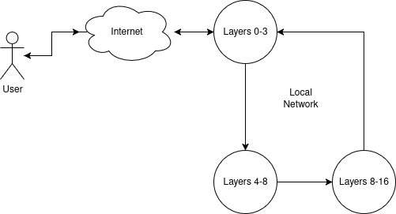

# Language Pipes

**Easily distribute language models across multiple systems**  

[![GitHub license][License-Image]](License-Url)
[![Release][Release-Image]][Release-Url] 
[![PyPI - Version]](PyPiVersion-Url)
[![PyPI - Python Version]](PythonVersion-Url)

[License-Image]: https://img.shields.io/badge/license-MIT-blue.svg
[License-Url]: https://github.com/erinclemmer/language-pipes/blob/main/LICENSE

[Release-Url]: https://github.com/erinclemmer/language-pipes/releases/latest
[Release-Image]: https://img.shields.io/github/v/release/erinclemmer/language-pipes

[PyPiVersion-Url]: https://img.shields.io/pypi/v/language-pipes
[PythonVersion-Url]: https://img.shields.io/pypi/pyversions/language-pipes

Language pipes is a distributed network application designed to increase accessabilitty to local language models. Over the past few years open source language models have become much more powerful yet the most powerful models are still out of reach of the general population because of the extreme amounts of RAM that is needed to host these models. Language Pipes allows multiple computer systems to host the same model and move computatiton data between them while being as easy as possible to set up.

#### Features:
- Quick Setup
- Peer to peer network
- OpenAI compatable API
- Download and use models by huggingface ID
- Encrypted communication between nodes

### What Does it do?
  
In a basic sense, language models work by passing information through many layers. At each layer, several matrix multiplicatitons are performed and the data is moved to the next layer. Language pipes works by hosting different layers on different machines to split up the RAM cost across the system.

#### How is this different from Distributed Llama?
[Distributed Llama](https://github.com/b4rtaz/distributed-llama) is built to be a static network and requires individual setup and allocation for each model hosted. Language Pipes meanwhile, has a more flexible setup process that automatically selects which parts of the model to load based on what the network needs and the local systems resources. This allows separate users to collectively host a network together while maintaining trust that one configuration will not break the network.

### Quick Start
To start using the application, install the latest version of the package from PyPi:
```bash
pip install language-pipes
```

Then, create a network key for the network:
```bash
language-pipes create_key network.key
```

Also create a `config.json` file to tell the program how to operate. Go to the [configuration documentation](/documentation/configuration.md) for more information.

Finally, start the server:
```bash
language-pipes config.json
```

### Contributing
* PRs and collaboration are welcome :)